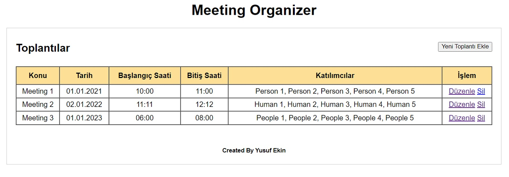
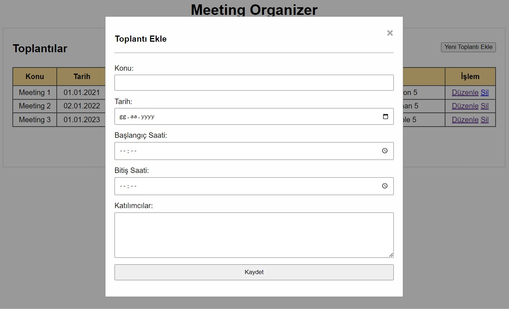
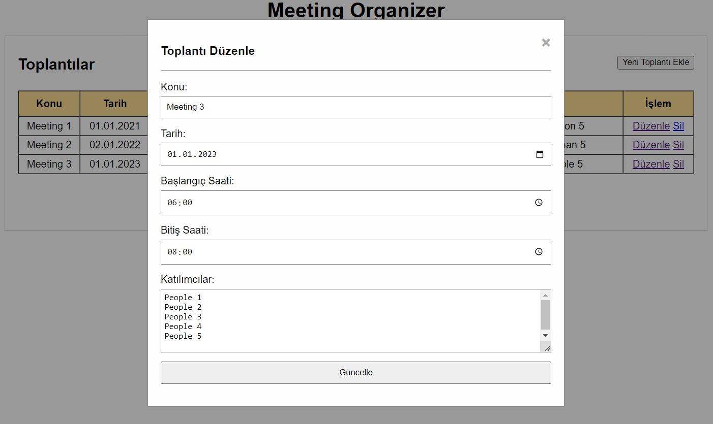

## Meeting Organizer
### Proje Tanımı:
Müşteriler ile yapılacak toplantıların kaydedilebileceği, güncellenebileceği ve silinebileceği bir tek sayfa uygulaması.

## Yapılanlar:
### - Toplantı Listesi


### - Toplantı Kayıt Formu


### - Toplantı Güncelleme Formu


## Başlangıç

> Terminalden aşağıdaki komutları çalıştırarak uygulamayı başlatabilirsiniz.

```
git clone https://github.com/yusufEk1n/Meeting-Organizer.git
```

```
cd Meeting-Organizer
```

```
python -m venv venv
```

```
venv\Scripts\activate
```

```
pip install -r requirements.txt
```

```
python app.py
```

## Gereksinimler
- Python
- Pip
- Virtualenv